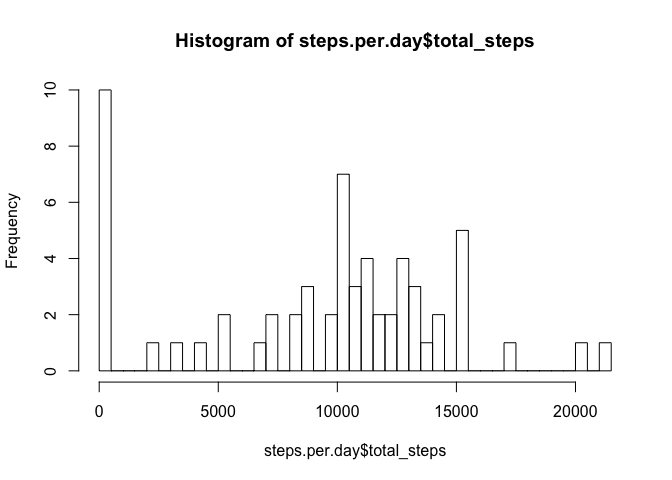
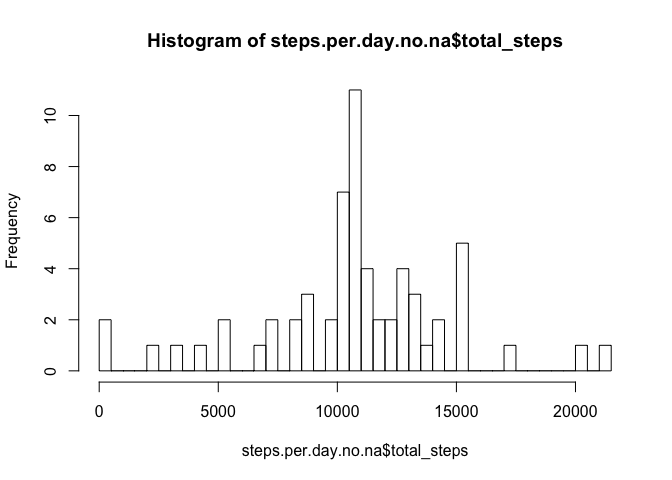
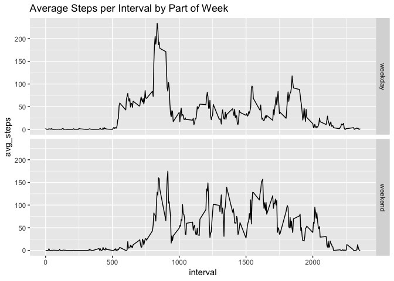

## Load required libraries

```r
library(dplyr)
```

```
## Warning: package 'dplyr' was built under R version 3.5.1
```

```
## 
## Attaching package: 'dplyr'
```

```
## The following objects are masked from 'package:stats':
## 
##     filter, lag
```

```
## The following objects are masked from 'package:base':
## 
##     intersect, setdiff, setequal, union
```

```r
library(ggplot2)
library(lubridate)
```

```
## 
## Attaching package: 'lubridate'
```

```
## The following object is masked from 'package:base':
## 
##     date
```

## Loading and preprocessing the data
Check to see if the zip file has already been extracted.  In not, unzip it.  Regardless load the activities.csv file.  Also confirm basic structure.


```r
if ( !file.exists("activity.csv")) unzip("activity.zip")
raw_data <- read.csv("activity.csv")
raw_data <- tbl_df(raw_data)
```
## histogram of steps per day


```r
steps.per.day <- raw_data %>% select(date, steps) %>%
  group_by(date) %>%
  summarize(total_steps = sum(steps, na.rm=T))

hist(steps.per.day$total_steps, breaks=nrow(steps.per.day))
```

<!-- -->

## What is mean & median total number of steps taken per day?


```r
mean.daily.steps = round(mean(steps.per.day$total_steps))
median.daily.steps = median(steps.per.day$total_steps)
```

The mean number of steps per day is: 9354 steps.  
The median number of steps per day is: 10395 steps.  


## What is the average daily activity pattern?  

Create a matrix by interval with average steps per interval


```r
steps.per.interval <- raw_data %>% 
  select(interval, steps) %>%
  group_by(interval) %>%
  summarize(avg_steps = mean(steps, na.rm=T))

max.interval.avg <- max(steps.per.interval$avg_steps)

max.interval <- steps.per.interval[steps.per.interval$avg_steps == max.interval.avg,1]
```

The interval with the maximum average steps is: 835.  

## Imputing missing values  

First let's see how many NAs we have for steps.  


```r
  num.na <- count(raw_data %>% filter(is.na(steps)))
```

The number of empty step records is: 2304.  

Since we've already calculted the mean for every interval, let's replace  
NA steps with the mean for that interval and see what the impact is.  


```r
interval.mean.actual <- inner_join(raw_data, steps.per.interval)
```

```
## Joining, by = "interval"
```

```r
interval.mean.no.na <- 
  interval.mean.actual %>% mutate(calc_steps = ifelse(is.na(steps), avg_steps, steps))

steps.per.day.no.na <- interval.mean.no.na %>% select(date, calc_steps) %>%
  group_by(date) %>%
  summarize(total_steps = sum(calc_steps))

hist(steps.per.day.no.na$total_steps, breaks=nrow(steps.per.day.no.na))
```

<!-- -->

## Are there differences in activity patterns between weekdays and weekends?  

we need to first of all add a column for weekday vs weekend  


```r
week.part.data <- raw_data %>% 
  mutate(week.part = ifelse(wday(date) == 1 | wday(date) == 7, "weekend", "weekday")) %>%
  select(week.part, interval, steps) %>%
  group_by(week.part, interval) %>%
  summarize(avg_steps = mean(steps, na.rm = T))

ggplot(week.part.data, aes(interval, avg_steps))+
  geom_line()+facet_grid(week.part~.)+
  labs(title="Average Steps per Interval by Part of Week")
```

<!-- -->
